# Master Thesis: decentralized application for signing and enforcing legal contract with Decentralized Identity and Verifiable Credentials
[MasterThesisPDF](/thesis.pdf)

[A good 3 minute introduction to Decentralize identity and Verifiable Credential by Microsoft](https://www.youtube.com/watch?v=Ew-_F-OtDFIc)

I developed this project as part of my master thesis. The application allows users to creat and to sign contracts or documents online with Decentralized Identity (DID) and Verifiable Credential (VC). The users can choose to insert verified personal information from the Verifiable credential into the contract's document. This is different from a normal document signing when only your signature is a signature and the rest of the document are just plain texts. This time the important information you fill in the document, such as national ID or date of birth, are the signature themselves provided that they came frome the verifiable credentials. 

While the document itself is never exposed to the public, its integrity can still be verified and authenticated by anyone since the application leave a cryptographic proof on the blockchain when the documents are signed. In case of the simple contract like lease agreement, the application allow users to turn the term of the contract into the smart contract and deployed its to the Ethereum blockchain (testnetwork) for enforcement. For more information, refer to the pdf file link aboved. 

Note that this repository is for a concept demo to showcase the application of blockchain in contract signing, you can not just clone this project and use it, since it required a verifiable credential that is issued by me (the only trusted issuer recognized by the application), which I do not have a server up running to issue people anymore. In real-world application, you can chose to accept any verifiable credential from any issuer, at the time of my thesis (2022-2023), the concept of verifiable credential is still new and developing, so I could not write code to accept ANY verifiable credential yet.


[2 min overview video (THAI)](https://www.youtube.com/watch?v=qnFzamu_rJc)

[30-minute video explaining the theory (THAI) *bad quality stuttering mic](https://www.youtube.com/watch?v=9ErNtSxajyM)

[video demo of the application (THAI)](https://www.youtube.com/watch?v=sXPzEDTPo5s)


## Theory Overview

> All participants, the users, the web application, the issuer (identity provider), create a decentralized identity to represent themselves. The public key is stored inside a DID document published on the blockchain. The private key is kept secret.

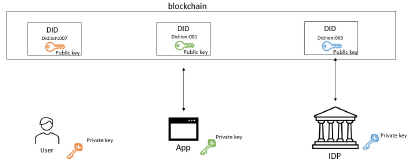

> User request a verifiable credential from an issuer of his choice. Identity verification is the responsibility of the issuer. The issuer may refuse to issue verifiable credentials if the user does not have enough evidence to authenticate himself. 

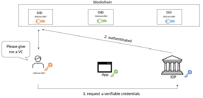

>If the user passes an identity check, the issuer will issue a verifiable credential, binding user real world identity to his DID. 

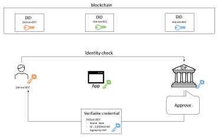

>The user is now ready to sign a contract. Note that if the user already has a verifiable credential from other use before, he can skip all the steps above and reuse the old one. 

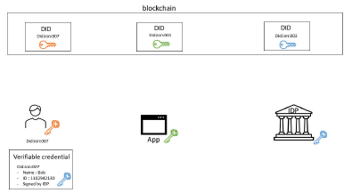

>The user can authenticate himself with the web application by using a verifiable credential. The user must use his private key to claim its ownership, showing that this verifiable credential is not a stolen one. 

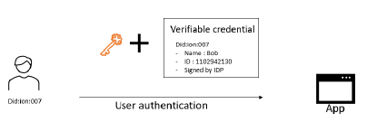

>the web application verifies the integrity and the authenticity of this verifiable credential with proof store inside an issuer DID. This step will not be notified to the issuer, keeping an interaction between users and web applications a secret to everyone else. 

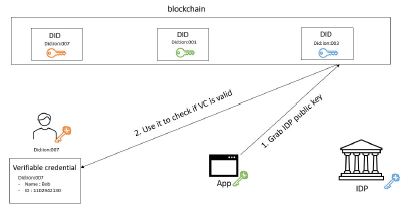

>if there are multiple signers involves, the web application will share these verifiable credentials with all involves parties. At this point, all participants learn of each other’s identity. Ready to draft and sign a contract. 

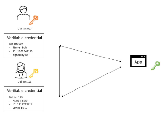

>the web application allows user to fill in the form of the contract with an information inside a verifiable credentials. In other words, the users sign a document with verifiable credentials. This is what it means to use verifiable credentials as an electronic signature. It’s like attaching the digital ID with the contract document.  The web application allows the landlord to force the user to fill in the contract with only a verified data, forcing the tenant to go and obtain the verifiable credentials from a trusted issuer first. 
The last step involves each party signing a document with their private keys, including the web application. The reason the web application key is needed is to add extra security, to ensure that the document creates these ways (green 
text=verified data), is not arbitrarily forge to look like one. (Anyone can create a fake green text, but if the web application is overseeing the whole operation, then this cannot be done). 

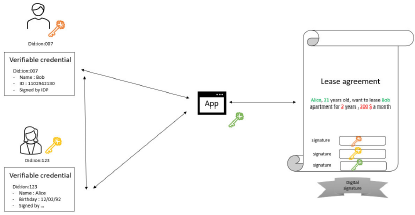
 
> The web application generates a smart contract and publishes it on an Ethereum blockchain. If the user uses a contract template provided by the web application, then this smart contract is automatically generated. For a custom contract, or if the landlord wants to add in an extra term, the landlord can use a tool provided by a web application to manually add these enforcing conditions to a smart contract. In the future, the web application might use AI to determine the term of the contract just from a text document. 

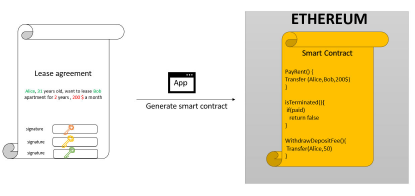

> While not necessary, the web application should build a smart contract factory to record all the smart contracts that has been deployed. The smart contract factory records which smart contract belongs to which users. This way, the users can interact with their smart contracts from the web application at any time, i.e., The web application acts as an intermediary between user and blockchain. Alternatively, if a user wants to do things in the most decentralized way possible, the user can choose to interact with the smart contract directly from Ethereum by himself. Note that he must remember the smart contract address to locate it on the blockchain.

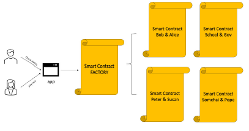

> All the steps mentioned above required the user to be competent enough to manipulate their own private key. We use a different approach in our web application. We abstract away all the operation on the user’s side, by relying on a decentralized identity as a service by Microsoft Entra. The user can obtain and share their verifiable credentials simply by using a QR code on a phone.  

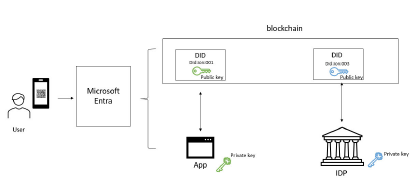

## App Functionality
1.	Allow users to authenticate each other using verifiable credentials.
2.	Allow users to draft a contract from scratch or from a provided template.
3.	Allow users to sign a contract with infomation from the verifiable credential.
4.	Allow users to save a signed contract in a pdf format.
5.	Allow anyone to verify and authenticate the signed contract.
6.	Allow users to enforce the term of the lease agreement with smart contracts.
7.	Allow users to view and interact with the deployed smart contracts.
8.	Allow tenants to pay rent and landlords to receive money in cryptocurrency.
9.	Allow tenant and landlord to use a smart contract as an escrow. 


## example use case : LEASE AGREEMENT
scenario: The tenant want to rent the aparment.
### prerequisite for both party
1. The tenant and the landlord create their decentralized identities on a blockchain of their choice. (For our project, we support DIDs from ION, a layer 2 Bitcoin blockchain.)
2. The tenant and the landlord obtain Verifiable Credentials from a trusted issuer. The verifiable credentials can be about anything, for example, if a tenant want to proof that he is a student when he signs a contract, then he need a verifiable credentials that was issues by the university that can verify his student status. 
### signing
1. Both parties upload their Verifiable credentials to the application (our demo only support VC from microsoft entra)
2. The application will validated these verifiable credentials with the issuer. If verified, it can be inserted into the contract.
3. For example, if the tenant uses their national ID verifiable credential, then he can insert his date of birth into the contract document. 
4. Once both parties finish drafting the contract, the application will ask them to signed the contract with their decentralized identity private key.
5. The term of the contract, for example, lease duration, montly payment, deposite fee, etc., will be published on the Ethereum blockchain as a smart contract.
6. The tenant can pay the rent in cryptocurrency manually on the blockchain himself, or through our web application.
7. If the tenant can not fullfil the terms of the contract, the smart contract will forcefully terminate the contract and notify the landlord.

## Application Explantion

>web application structure

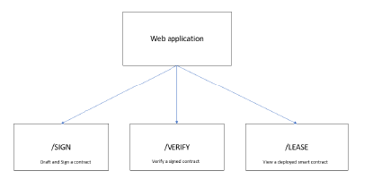


>This is an example of how a verifiable credential looks like on a phone (Microsoft authenticator app).  Users can share this verifiable credential with anyone via a QR code.

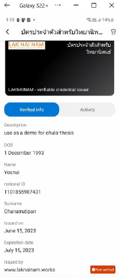


> Users can authenticate each other in a user authentication tab. Draft tab allow user to draft a contract template. The sign tab is for users to fill in the contract and sign it. 

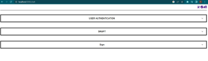


>USER AUTHENTICATION TAB; allow user to scan a QR code to share a verifiable credentials, (the website will send a verifiable credential request to the user phone) 

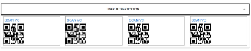


> The picture show a credential request when the user scan the QR code with their verifiable credentials

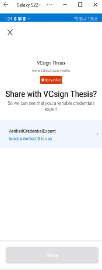


>The user successfully authenticated himself. If there are multiple signer, they can scan the other QR code. Once verified, the user can use these credentials obtained from a verifiable credentials to sign the contract. 

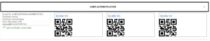


>DRAFT Page; allows users to draft any type of contract. The square bracket denotes a form that required a user input in a contract. There are two types of square brackets. The one ends with “:VC” and the one that doesn’t.  VC symbol indicates that this data must be filled with verified information obtained from a verifiable credential. For example, [ผู้ให้เช่า:VC] is the name of the landlord. The landlord must authenticate himself using a verifiable credentials first, only then he can fill in this information using a data from a verifiable credential he used to authenticate himself.  For the square bracket that ends without VC, the website does not limit what the signer can fill in the form there. 

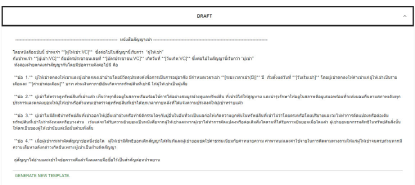


>SIGN Page; The users can fill in a form and sign a contract here. The form on the left and the document on the right is automatically generated from a contract template the user draft in draft tab. The green text indicates that this part of the contract is an electronic signature that comes from the verifiable credentials. The red text is the data that does not come from verifiable credentials. Once all parties agree on the contract, click Sign. The website will sign this contract with its decentralized identity private key.  

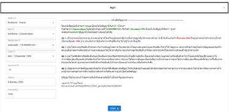


>Digital signature from a signed contract; Signing a contract result in two files, the document of the contract in pdf format and the digital signature signed by the web application. In this figure, we show an example of the digital signature of a signed contract. Anyone can use this digital signature to verify the integrity and authenticity of the signed contract using a public key of a web application. 

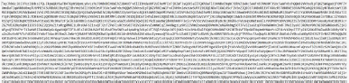


>A signed contract in PDF format. The green text represents an electronic signature extract from verifiable credentials. The red text is where the users just type in the data normally. The pdf is watermarked with the decentralized identity identifier (DID) of a web application that signed this contract.  

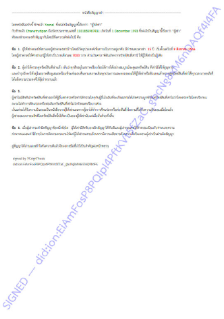


>The users can click “Enforce with smart contract” button to generate a smart contract that they wish to deployed on the blockchain. 

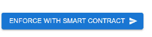


>Customizing smart contract; The landlord can specify the term of the contract manually; the web application will use these data to automatically generate a smart contract and deploy it on the blockchain.  

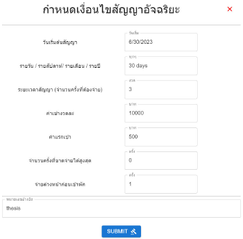


>The deployed contract is publicly available on blockchain. In this figure, we use Etherscan, a website that allows users to query the Ethereum blockchain, to view the deployed contract details, information, and its history. 

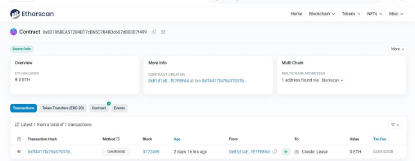


>The smart contract code deployed on the blockchain as view from Etherscan; The code resides on the blockchain, being immutable and timestamped, offers a great way to make sure that the term of the contract can be enforce in a transparent and undeniable ways. 

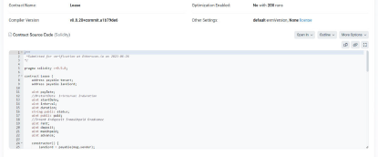


>DOCUMENT AUTHENTICATION; user can upload the signed document and a digital signature to verify the integrity and authenticity of the signed document. Note that the users can verify it themselves with the blockchain without relying on the web application.  

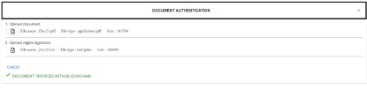


>Lease Page, allows tenant and landlord to view and interact with the deployed smart contract. 

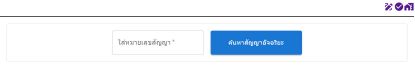


>The web application will read the state of that deployed smart contract, including all the variables inside it, and show it to the user as shown in the figure above.   
The tenant can pay rent from this page. Payment with cryptocurrency is supported through a MetaMask, a web browser crypto wallet. Note that we do not have technology to pay with real money yet due to the reason stated in Chapter 4. The payment can be automated if the user transfer fund to the smart contract in advance. 

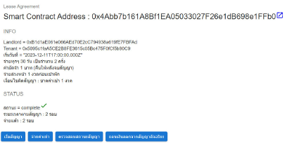


>MetaMask is shown on the right-hand side of the figure. The tenants can pay rent directly from the web browser with a crypto wallet (not necessarily have to be MetaMask, there are many available crypto wallets to choose from) 

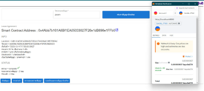


>Interacting with the smart contract leave an immutable recorded on the blockchain that can be seen by anyone in the world.  In the figure above we used Etherscan to track the smart contract usages, we can see a tenant paying rent and deposit with the smart contract method “Pay_rent” and “Pay_deposit”, and see a landlord withdraw the money with “LandlordWithdraw” method. 

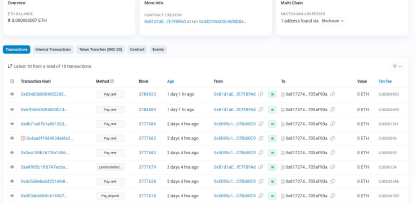


### INSTALLATION
```
git clone https://github.com/TaroAndMulan/VCsignAlpha.git
cd VCsignAlpha
npm install
```

### RUN

* Run the react project
```
npm run dev 
```

* SETUP NGROK SERVER from the terminal
```
ngrok http 8080
```

* Acces the application from the web browser through the ngrok url obtain above

```
> chrome/edge/fireforx/safari -> [ngrok_url]/ 
```

